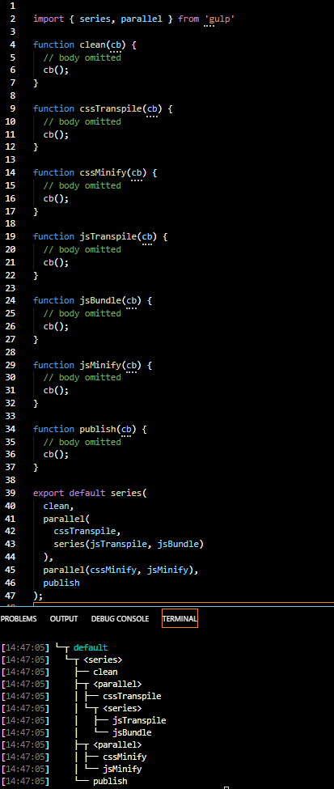

# Gulp with TypeScript Study Note


## Installation 

Commands
```
$ npm init
$ npm i --save-dev gulp
```

```
# This allow gulpfile supports TypeScript. e.g. gulpfile.ts
$ npm install --save-dev typescript gulp@4.0.0 gulp-typescript
```

## Private vs Public Task

- private task is not exported from the js file. 
- public tasks are exported functions from the js file.

```
# Check the task hierarchy
$ gulp --tasks
[14:01:40] Tasks for gulpfile.ts
[14:01:40] ├── build
[14:01:40] └─┬ default
[14:01:40]   └─┬ <series>
[14:01:40]     ├── clean
[14:01:40]     └── build
```

## Compose Task

Gulp provides two powerful composition methods, ```series()``` and ```parallel()```, allowing individual tasks to be composed into larger operations. Both methods accept any number of task functions or composed operations. series() and parallel() can be nested within themselves or each other to any depth.
- To have your tasks execute in order, use the ```series()``` method.
- For tasks to run at maximum concurrency, combine them with the ```parallel()``` method.

[compose-task.ts](./src/compose.task.ts)


## Async Completion

### Signal task completion

When a stream, promise, event emitter, child process, or observable is returned from a task, the success or error informs gulp whether to continue or end. If a task errors, gulp will end immediately and show that error.

When composing tasks with ```series()```, an error will end the composition and no further tasks will be executed. When composing tasks with ```parallel()```, an error will end the composition but the other parallel tasks may or may not complete.

#### Returning a stream
- [stream.ts](./src/stream.ts)

#### Return a promise
- [promise.ts](./src/promise.ts)

#### Return an event emitter
- [event-emitter.ts](./src/event-emitter.ts)

#### Returning a child process
- [child-process.ts](./src/child-process.ts)

#### Returning an observable
- [observable.ts](./src/observable.ts)

#### [Using an error-first callback ](https://gulpjs.com/docs/en/getting-started/async-completion#using-an-error-first-callback)


### No synchronous tasks

Synchronous tasks are no longer supported. They often led to subtle mistakes that were hard to debug, like forgetting to return your streams from a task.

When you see the _"Did you forget to signal async completion?"_ warning, none of the techniques mentioned above were used. You'll need to use the error-first callback or return a stream, promise, event emitter, child process, or observable to resolve the issue.

### Using async/await

When not using any of the previous options, you can define your task as an ```async``` function, which wraps your task in a promise. This allows you to work with promises synchronously using ```await``` and use other synchronous code.

[example](./src/async-await.ts)


## [Working with Files](https://gulpjs.com/docs/en/getting-started/working-with-files#working-with-files)

- ```src```
- ```pipe```
- ```dest```

Most often plugins will be placed between ```src()``` and ```dest()``` using the ```.pipe()``` method and will transform the files within the stream.

## [Explaining Globs](https://gulpjs.com/docs/en/getting-started/explaining-globs#explaining-globs)

A glob is a string of literal and/or wildcard characters used to match filepaths. Globbing is the act of locating files on a filesystem using one or more globs.

The ```src()``` method expects a single glob string or an array of globs to determine which files your pipeline will operate on. At least one match must be found for your glob(s) otherwise ```src()``` will error. When an array of globs is used, they are matched in array order - especially useful for negative globs.

## [Using Plugins](https://gulpjs.com/docs/en/getting-started/using-plugins)

- [plug-in registry](https://gulpjs.com/plugins/)

Gulp plugins are Node Transform Streams that encapsulate common behavior to transform files in a pipeline - often placed between ```src()``` and ```dest()``` using the ```.pipe()``` method. They can change the filename, metadata, or contents of every file that passes through the stream.

### Conditional plugins 
```
const { src, dest } = require('gulp');
const gulpif = require('gulp-if');
const uglify = require('gulp-uglify');

function isJavaScript(file) {
  // Check if file extension is '.js'
  return file.extname === '.js';
}

exports.default = function() {
  // Include JavaScript and CSS files in a single pipeline
  return src(['src/*.js', 'src/*.css'])
    // Only apply gulp-uglify plugin to JavaScript files
    .pipe(gulpif(isJavaScript, uglify()))
    .pipe(dest('output/'));
}
```
### Inline plugins

- Instead of creating and maintaining your own plugin.
- Instead of forking a plugin that exists to add a feature you want.

## [Watching Files ](https://gulpjs.com/docs/en/getting-started/watching-files#watching-files)

The ```watch()``` API connects globs to tasks using a file system watcher. It watches for changes to files that match the globs and executes the task when a change occurs. If the task doesn't signal Async Completion, it will never be run a second time.

